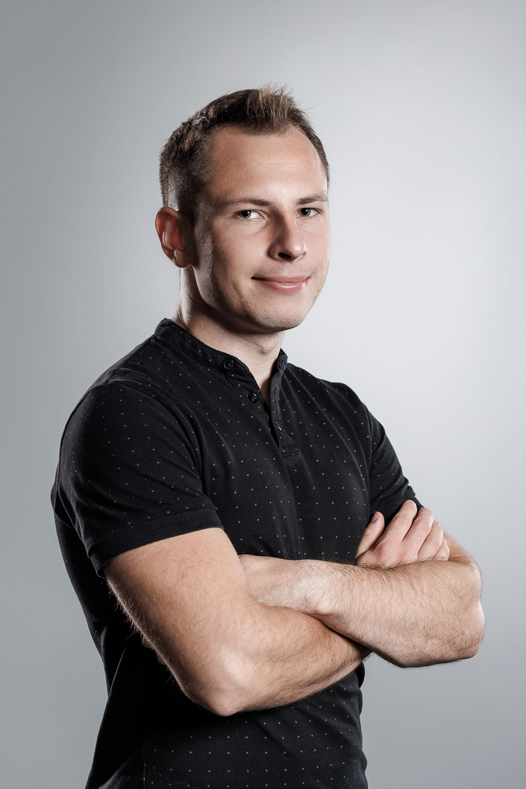

# About

<!--author-->

<!-- {: width="250" height="80"} -->

<!-- 

 -->

I am a fifth year PhD student at Harvard, fortunate to be advised by [Professor Norman Yao](https://www.physics.harvard.edu/people/norman-y-yao) and part of the inaugural cohort of the Quantum Science and Engineering program within [Harvard Quantum Initiative](https://quantum.harvard.edu/). I am also a Harvard AI Fellow. My research spans AI for materials and quantum many-body systems, exotic phases of matter, quantum computing and quantum sensing. 

The question driving me right now: can AI agents run science end-to-end — from theoretical hypothesis to experimental discovery, autonomously? That prospect is equal parts thrilling and terrifying. I've been lucky to help build toward that vision at [Periodic Labs](https://techcrunch.com/2025/09/30/former-openai-and-deepmind-researchers-raise-whopping-300m-seed-to-automate-science/) from its early days — first full-time, then part-time — a company on a mission to build an AI scientist.

When I’m not grinding, I’m usually at the gym, out for a run, cycling, or enjoying nature. I also serve as President of the [Harvard GSAS Polish Student Association](https://www.linkedin.com/company/harvard-gsas-polish-student-association).

I hold master’s degrees from Harvard University (MA Quantum Science), University College London (MSci Physics and MRes Quantum Technologies) and previously worked at the [London Centre for Nanotechnology](https://www.london-nano.com/). 

I hail from [Lublin, Poland](https://en.wikipedia.org/wiki/Lublin).

> **Contact:** dkufel [at] g.harvard.edu
{:.lead}
